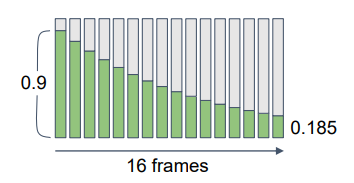

# Temporal filtering

将样本分布到多个帧当中


## 步骤1

### 调整投影矩阵

```cc
ProjMatrix[2][0] += ( SampleX * 2.0f – 1.0f ) / ViewRect.Width();
ProjMatrix[2][1] += ( SampleY * 2.0f – 1.0f ) / ViewRect.Height();
```

### 样本模式

要一个低差异序列, 在空间和时间上都没有聚集

普通样本


Halton (2,3) 样本


### 投影矩阵抖动

```cc
// 来自于维基百科 https://en.wikipedia.org/wiki/Halton_sequence

static const float Halton_2[8] = {
	1.f / 2.f,    1.f / 4.f,    3.f / 4.f,    1.f / 8.f,
    5.f / 8.f,    3.f / 8.f,    7.f / 8.f,    1.f / 16.f,
};

static const float Halton_3[8] = {
	1.f / 3.f,    2.f / 3.f,    1.f / 9.f,    4.f / 9.f,
    7.f / 9.f,    2.f / 9.f,    5.f / 9.f,    8.f / 9.f,
};

static uint frameCount = 0;
UINT subsampIndex = frameCount % 8;
float xJitter = (Halton_2[subsampIndex] * 2.f - 1.f) / Width;
float yJitter = (Halton_3[subsampIndex] * 2.f - 1.f) / Height;

Matrix4 proj = pCamera->getMatProj();
proj.r[2].m128_f32[0] += (float)JitterX;//_31
proj.r[2].m128_f32[1] += (float)JitterY;//_32
```

## 步骤2 混合历史帧(Blending History Samples)

最简单的方法即是将 N 个历史帧叠加取平均值, 但这样我们需要额外保存前 N 个历史帧, 在混合的 pass 中对 N 个历史帧进行采样混合. 但是这也消耗的显存很大.

### Exponential History

我们可以采用另一种混合方式，将当前帧的渲染画面与前一帧混合后的画面按一定比例混合:
$$
\rm { Output(t) = \alpha \cdot Input(t) + (1 − \alpha) Output(t−1) }
$$
当系数 α 足够小时，上述指数混合将会近似等于叠加取平均的结果
$$
\rm { 
 	x_t = x_{t-n} \Rightarrow s_t = \frac{ \alpha }{1 - (1 - \alpha)^n} \sum_{k=0}^{n-1}(1 - \alpha)^k_{t-k}
}
\\
\rm {
	\lim_{\alpha \rightarrow 0 }\frac{ \alpha }{1 - (1 - \alpha)^n} \sum_{k=0}^{n-1}(1 - \alpha)^k_{t-k} \frac{1}{n} \sum 	x_{t-k} 
}
$$
于是我们就只需要保存并读取前一帧混合的结果。α 的取值应该根据所选择的采样点数量调整, α 过大将会导致混合后的历史帧无法保留一个完整的 sampling pattern，造成画面抖动的问题.


