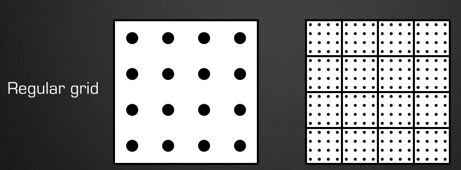
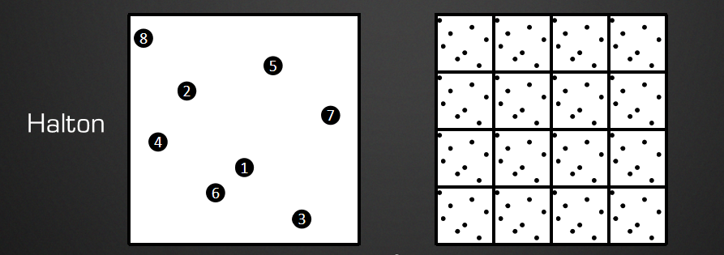

# Temporal filtering

将样本分布到多个帧当中


## 步骤1

### 调整投影矩阵

```cc
ProjMatrix[2][0] += ( SampleX * 2.0f – 1.0f ) / ViewRect.Width();
ProjMatrix[2][1] += ( SampleY * 2.0f – 1.0f ) / ViewRect.Height();
```

### 样本模式

要一个低差异序列, 在空间和时间上都没有聚集

普通样本




Halton (2,3) 样本




### 投影矩阵抖动

```cc
// 来自于维基百科 https://en.wikipedia.org/wiki/Halton_sequence

static const float Halton_2[8] = {
	1.f / 2.f,    1.f / 4.f,    3.f / 4.f,    1.f / 8.f,
    5.f / 8.f,    3.f / 8.f,    7.f / 8.f,    1.f / 16.f,
};

static const float Halton_3[8] = {
	1.f / 3.f,    2.f / 3.f,    1.f / 9.f,    4.f / 9.f,
    7.f / 9.f,    2.f / 9.f,    5.f / 9.f,    8.f / 9.f,
};

static uint frameCount = 0;
UINT subsampIndex = frameCount % 8;
float xJitter = (Halton_2[subsampIndex] * 2.f - 1.f) / Width;
float yJitter = (Halton_3[subsampIndex] * 2.f - 1.f) / Height;

Matrix4 proj = pCamera->getMatProj();
proj.r[2].m128_f32[0] += (float)JitterX;//_31
proj.r[2].m128_f32[1] += (float)JitterY;//_32
```

## 步骤2混合历史帧

