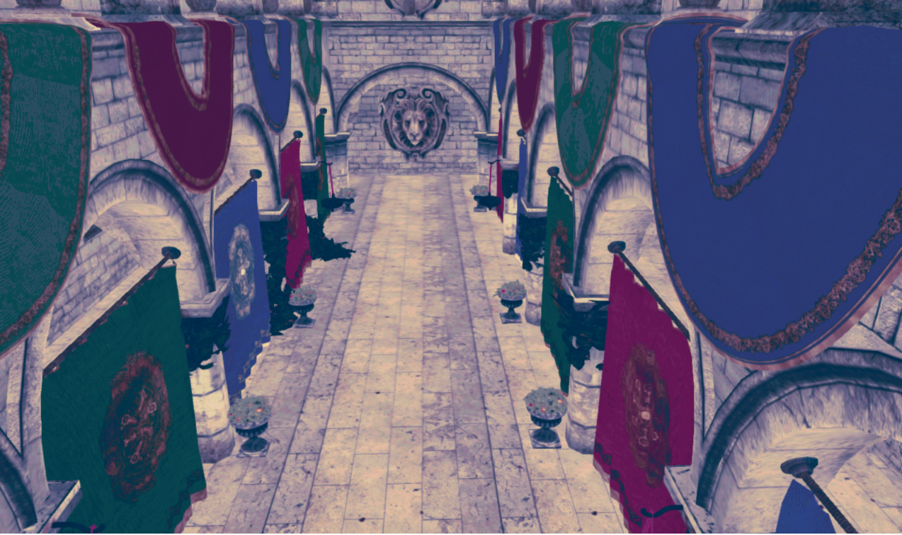
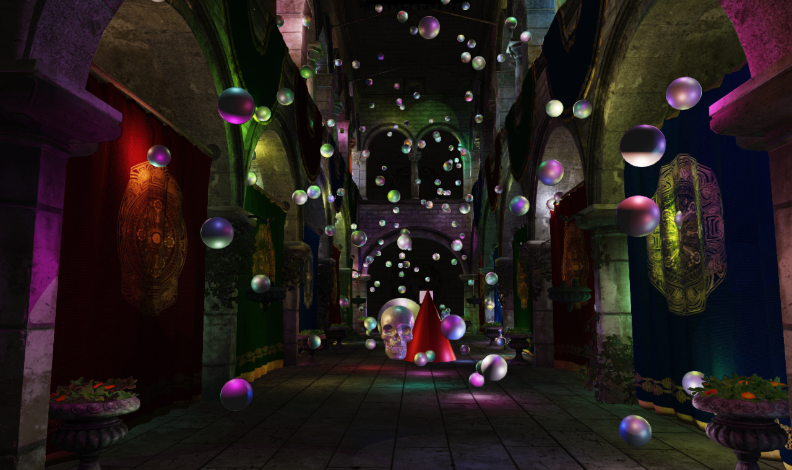

# Eureka

## Build

```shell
git clone --recursive https://github.com/shenxin-karl/Eureka.git
cd Eureka
start build.bat
```


## 

## Features:

- [x] Shader Resource Binding System
- [x] Resource State Tracking System
- [x] Render Graph System


## Effect

### ACES / ColorGrading / GammaCorrection / FXAA 

Tag: [/Eureka at v1.0](https://github.com/shenxin-karl/Eureka/tree/v1.0)

在一个 Compute Shader 中完成 ACES ColorGrading GammaCorrection 后处理, 在 Pixel Shader 中实现 FXAA, 同时拷贝到 BackBuffer 中



### Tile Based Deferred Rendering

Tag: [Eureka at v1.1](https://github.com/shenxin-karl/Eureka/tree/v1.1)

Compute Shader 中按照 16x16 将屏幕分为 Tile, 计算出 Tile 的子视锥体, 和点光源求交判断剔除. 在 LightingPass 中获得当前 Tile 的光源列表计算着色



